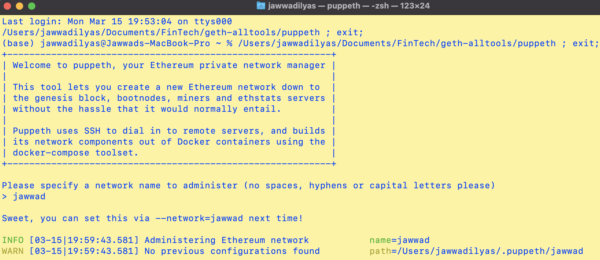

# Creating two nodes with accounts

Create two accounts for nodes to use for mining rewards.

Then, initialize the nodes using the genesis block configuration that created earlier.

## Instructions
* Navigate to the `geth-alltools` folder and double click puppeth file. This will open puppeth Terminal Window.

 ```bash
 /Users/jawwadilyas/Documents/Fintech/geth-alltools/puppeth
 ```

* In the following prompt: Type Jawwad for Network Name and hit enter for next question.

 

To export genesis configuration into a `jawwad.json` file as follows:

* In the `puppeth` prompt, navigate to the `Manage existing genesis` by typing `2` and hitting enter.

* You may have to type your network name again first if you're launching `puppeth` fresh.

* Then, type `2` again to choose the `Export genesis configurations` option, and continue with the default (current) directory by hitting enter:

 

* This will export json files -- we will only be using `jawwad.json`.

Now, we need to create at least two nodes to build the chain from the genesis block onward:

* Exit `puppeth` by using the `Ctrl+C` keys combination.

* Create the first node's data directory using the `geth` command and a couple of command line flags by running the following line in your terminal window (Git Bash in Windows):

 ```bash
 ./geth account new --datadir node1
 ```

You should see a success message similar to this one:


* Create a new text file for notes, and copy the node's address into the file and label it `Node 1 Key`.

* Repeat the same process for the second node by replacing the `datadir` parameter with the `node2` folder.

 ```bash
 ./geth account new --datadir node2
 ```


* Make sure to keep track of the node's addresses and which belongs to which. 

Now, it's time to initialize and tell the nodes to use your genesis block!

* Initialize the first node, replacing `yournetworkname.json` with your own:

 ```bash
 ./geth init jawwad.json --datadir node1
 ```

You should see this success message:


* Since you only initialize your nodes once, you don't need to copy anything into your notes here.

* Run the same command for `node2`.

 ```bash
 ./geth init jawwad.json --datadir node2
 ```

