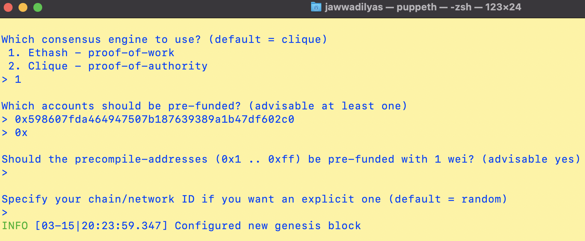
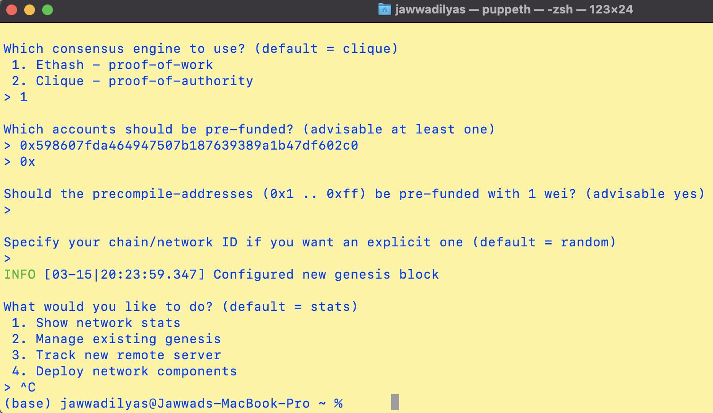

# Creating a Genesis Block

Creating a Genesis Block

## Instructions

* Navigate to the `geth-alltools` folder and double click puppeth file. This will open puppeth Terminal Window.

 ```bash
 /Users/jawwadilyas/Documents/Fintech/geth-alltools/puppeth
 ```

* In the following prompt: Type Jawwad for Network Name and hit enter for next question.

 

* Type option `2` to pick the `Configure new genesis` and hit enter for next question.
* Type option `1` to pick `Create new genesis from scratch` and hit enter for next question.
* Type option `1` to pick `Ethash - proof-of-work` for consensus engine (algorithm)

 

You will be asked to enter a pre-fund account.

* Copy and paste an address from your Ethereum wallet in MyCrypto, without the `0x` prefix.

* Once you paste an address and hit enter, hit enter again on the blank `0x` address to continue the prompt.

* Continue with the default option for the prompt that asks `Should the precompile-addresses (0x1 .. 0xff) be pre-funded with 1 wei?` by hitting enter again,
 until you reach the `Chain ID` prompt.

 

* Come up with a number to use as a chain ID (e.g. `333`) type it, then hit enter.

You should see a success message and be redirected to the original prompt:



Genesis configuration is stored in your local home directory.
