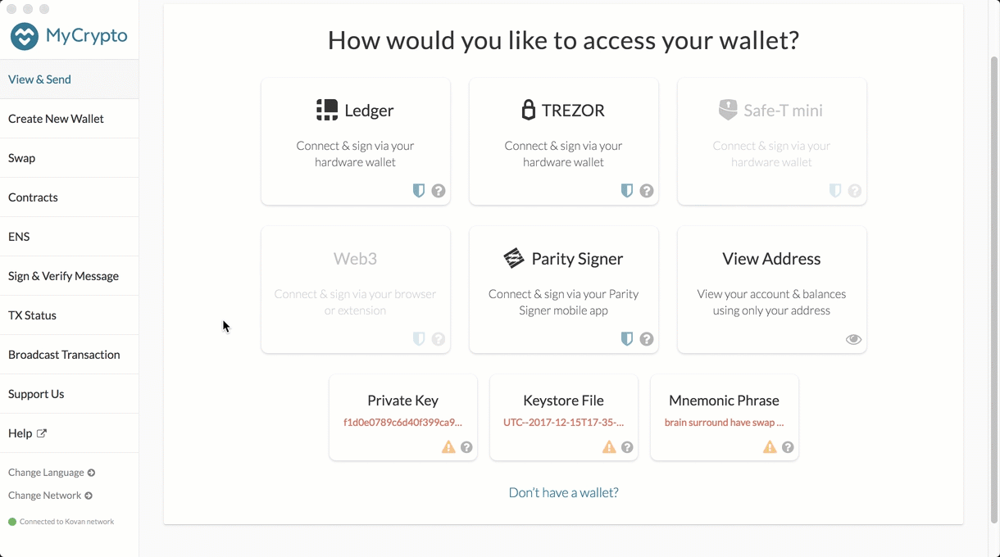

# Connecting chain

In this step, connecting MyCrypto to created chain, importing your pre-funded wallet, then sending a test transaction to yourself!

## Instructions

Get the private key.

* Open up MyCrypto to get the private key of the ETH address you used to pre-fund your chain. Make sure `Kovan` network is selected.

 

* Unlock wallet using mnemonic phrase and choose the address you want to inspect.

* Select the ETH address you used to pre-fund your chain, and in the "Select" dropdown list, choose `Wallet Info`.

* Click on the eye icon next to the `Private Key` field, and copy and paste the private key of the wallet. Keep this handy, as you will use it in a bit.

 

Now you are going to connect MyCrypto with the blockchain created. Follow the next steps.

* Open up MyCrypto, then click `Change Network` at the bottom left:

 

* **NOTE:** Changing networks will automatically clear your loaded wallet, so make sure your private key has been stored in your notes for use in the next steps. 

* Click "Add Custom Node", then add the custom network information that you set in the genesis.

* Make sure that you scroll down to choose `Custom` in the "Network" column to reveal more options like `Chain ID`:

 

* The chain ID must match what you came up with earlier.

* The URL must point to the default RPC port on your local machine. Use `http://127.0.0.1:8545`.

* Once you save and use the network, double-check that it is selected and is connected.

Now that you are connected to your blockchain, you will need to load the private key you created and funded on the network.

* On the left pane menu, click on "View & Send".

* Next, click on the "Private Key" option to continue.

 

* A new window will pop-up. Paste the private key of the pre-funded wallet and click on the "Unlock" button to continue.

 

* These millions of ETH tokens are just for testing purposes.

 

Test the transaction by sending to same account.

* Copy the pre-funded address into the "To Address" field, then fill in an arbitrary amount of ETH:

 

* Confirm the transaction by clicking "Send Transaction", and the "Send" button in the pop-up window.

 

* Click the `Check TX Status` when the green message pops up, then confirm the logout:

 

* Monitor the transaction go from `Pending` to `Successful` in around the same block time you set in the genesis.

* You can click the `Check TX Status` button to update the status.

 

---

-- Mostly the images and the contents are copied from gitlab Activity number Week 18 Day 3 folder 05-Stu_Transact/Images, except the last one this transaction done using custom network puppernet
