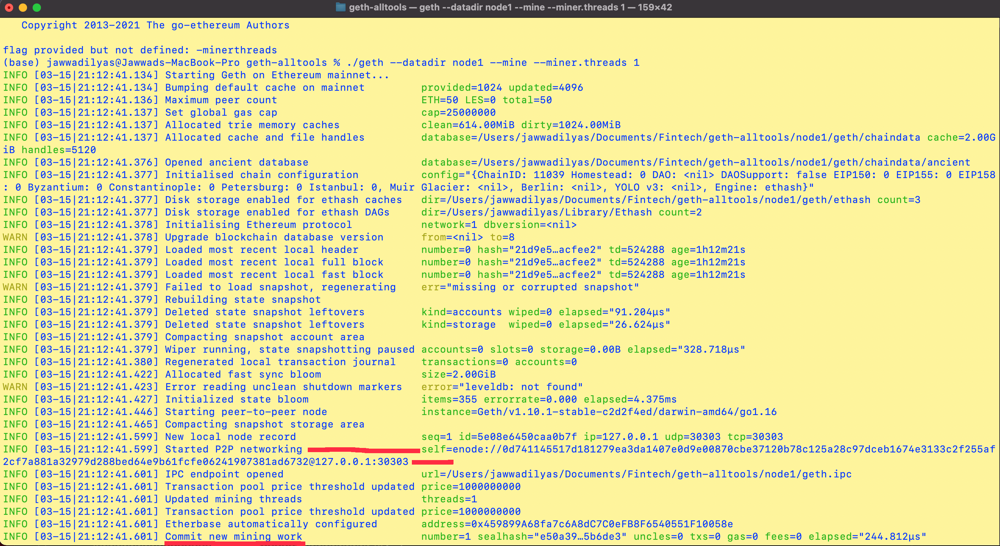
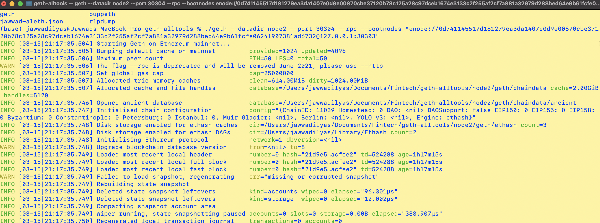

# Launch your Nodes

In this step, you will start both previously created nodes.

* `node1` will be a full node that is also mining.

* `node2` will be a full node that exposes an RPC port, allowing you to talk to it with other apps like MyCrypto.

## Instructions

Open a terminal window navigate to your `geth-alltools` folder and follow the next steps.

 ```bash
 /Users/jawwadilyas/Documents/Fintech/geth-alltools/
 ```

* Launch the first node into mining mode with the following command:

 ```bash
 ./geth --datadir node1 --mine --miner.threads 1
 ```

 * The `--mine` flag tells the node to mine new blocks.

 * The `--miner.threads` flag tells `geth` how many CPU threads, or "workers" to use during mining. Since our difficulty is low, we can set it to 1.

You should see the node `Committing new mining work`:



* Copy this command into your notes and label it `Start Node 1`.

For second node launch.

* Scroll up in the terminal window where `node1` is running, and copy the entire `enode://` address (including the last `@address:port` segment) of the first node located in the `Started P2P Networking` line: as shows above 
 
```bash
 self=enode://0d741145517d181279ea3da1407e0d9e00870cbe37120b78c125a28c97dceb1674e3133c2f255af2cf7a881a32979d288bed64e9b61fcfe06241907381ad6732@127.0.0.1:30303

 ```

* Open another terminal window and navigate to the same directory as before.

* Launch the second node:

 * Running in OS X:
 ```bash
 ./geth --datadir node2 --port 30304 --rpc --bootnodes "enode://<replace with node1 enode address>"
 like:
 ./geth --datadir node2 --port 30304 --rpc --bootnodes "enode://0d741145517d181279ea3da1407e0d9e00870cbe37120b78c125a28c97dceb1674e3133c2f255af2cf7a881a32979d288bed64e9b61fcfe06241907381ad6732@127.0.0.1:30303"
 ```
* The output of the second node should show information about `Importing block segments` and synchronization:

 


